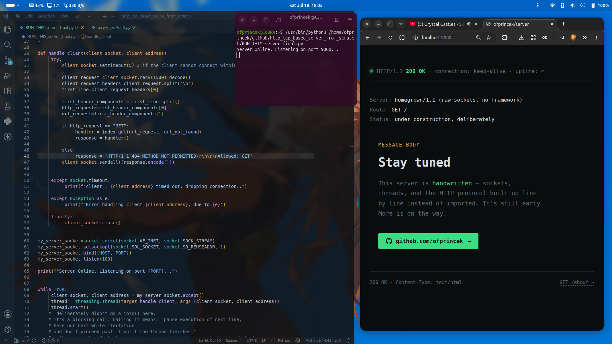

# http-tcp-based-server-from-scratch

A minimal HTTP server built directly on top of raw TCP sockets — no Flask, no Express, no `http.server`. Every layer that a framework normally hides — parsing the request line, routing, building a spec-compliant response, handling concurrent clients — is written and understood by hand.

This project exists to learn what's actually happening under an HTTP framework, not to ship something production-ready.



---

## What this is

- A TCP server (`socket` module) that speaks just enough HTTP/1.1 to serve a couple of pages
- One Python thread spun up per incoming connection, so a slow client can't freeze the whole server
- A per-connection socket timeout, specifically to guard against Slowloris-style stalls
- Dict-based routing (`path -> handler function`) instead of an if/elif chain
- Two hand-styled HTML pages served from disk

## What this is *not*

- Not HTTPS/TLS-capable — it only speaks plaintext HTTP. Hitting it with `https://` will crash the decode step, because a TLS handshake is binary, not text (see [Known limitations](#known-limitations)).
- Not built for large or streamed request bodies — `recv()` is called once per request with a fixed buffer size.
- Not persistent-connection aware — every response closes the socket rather than reusing it (`Connection: keep-alive` is not implemented).

---

## Running it

```bash
python3 RUN_THIS_server_final.py
```

Update the hardcoded file paths in `site_homepage()` and `site_about()` to point at wherever you've cloned `homepage.html` and `about.html` on your own machine.

Then hit it with:

```
http://localhost:9000/
http://localhost:9000/about
```

Note the `http://`, not `https://` — see [Known limitations](#known-limitations).

---

## How it works

### 1. Socket setup

```python
my_server_socket = socket.socket(socket.AF_INET, socket.SOCK_STREAM)
my_server_socket.setsockopt(socket.SOL_SOCKET, socket.SO_REUSEADDR, 1)
my_server_socket.bind((HOST, PORT))
my_server_socket.listen(100)
```

- `AF_INET` + `SOCK_STREAM` → IPv4 over TCP.
- `SO_REUSEADDR` lets the server rebind the same port immediately after a restart, instead of waiting out the OS's `TIME_WAIT` cooldown.
- `listen(100)` sets the size of the **backlog queue** — how many fully-handshaken-but-not-yet-`accept()`-ed connections the OS will hold at once. It is *not* a cap on total concurrent clients; once a connection is `accept()`-ed it leaves this queue entirely and is tracked independently.

### 2. Accepting clients — one thread each

```python
while True:
    client_socket, client_address = my_server_socket.accept()
    thread = threading.Thread(target=handle_client, args=(client_socket, client_address))
    thread.start()
```

`accept()` blocks until a client connects, then hands back a socket dedicated to that one client. Rather than handling requests one at a time, each client is handed off to its own thread via `handle_client`.

`.join()` is deliberately **not** called here. `.join()` blocks the calling code until the thread finishes — calling it right after `.start()` would force the main loop to wait for client A to fully finish before it could even `accept()` client B, defeating the entire purpose of threading. Skipping it lets `.start()` fire the thread and immediately return control to the loop, so the next `accept()` can happen right away while earlier clients are still being served in the background.

### 3. Parsing the request

```python
client_request = client_socket.recv(1500).decode(errors='ignore')
client_request_headers = client_request.split('\n')
first_line = client_request_headers[0]

first_header_components = first_line.split()
http_request = first_header_components[0]   # e.g. "GET"
url_request  = first_header_components[1]   # e.g. "/about"
```

`recv(1500)` reads up to 1500 bytes currently available on the socket — TCP is a byte stream with no built-in concept of "one request," so this number is just a buffer size choice, not a protocol limit. It does **not** guarantee the entire request arrived in one call; a request with a large body or many headers could be split across multiple `recv()`s. Handling that properly would mean looping `recv()` until `\r\n\r\n` (end of headers) is seen, then reading `Content-Length` more bytes for the body — not yet implemented here.

`errors='ignore'` on decode matters specifically because non-GET requests (or a client attempting TLS against this plaintext server) can contain raw binary bytes that aren't valid UTF-8. Since only the plain-ASCII request line is actually read, tolerating undecodable bytes elsewhere avoids crashing the thread outright.

### 4. Routing — a dict instead of if/elif

```python
def site_homepage():
    with open("/path/to/homepage.html") as homepage:
        content = homepage.read()
    return 'HTTP/1.1 200 OK\r\n\r\n' + content

def site_about():
    with open("/path/to/about.html") as about:
        content = about.read()
    return 'HTTP/1.1 200 OK\r\n\r\n' + content

def url_not_found():
    content = "URL not found, under construction.."
    return 'HTTP/1.1 404 NOT FOUND\r\n\r\n' + content

index = {
    '/': site_homepage,
    '/about': site_about,
}

handler = index.get(url_request, url_not_found)
response = handler()
```

Dictionary values here are **references to functions**, not calls to them — notice `site_homepage`, no parentheses, when building `index`. `index.get(url_request, url_not_found)` looks up the requested path; if it's not a key in the dict, it falls back to `url_not_found` instead of raising a `KeyError`. Only once `handler` is resolved does `handler()` actually call it and produce the response string. This is conceptually the same mechanism frameworks like Flask use under the hood for `@app.route(...)`, just without the decorator syntax.

This only matches exact static paths — no `/users/42`-style dynamic segments or wildcards. That would need pattern matching (regex or a real router) layered on top.

### 5. CRLF — why every response needs `\r\n\r\n`

HTTP/1.1 (RFC 7230) requires `\r\n` (carriage return + line feed) as the line terminator for the status line, every header, and the blank line separating headers from the body — not just `\n`. Some clients tolerate a bare `\n`, but stricter parsers (Thunder Client, for one) will reject it outright with a parse error. `\r` and `\n` are separate, historically distinct characters (carriage return vs. line feed, from typewriter conventions) that Unix collapsed into just `\n` for text files — HTTP never made that simplification, so both are required, always, in a hand-built response.

The status line itself also needs a **status code and reason phrase**, not just the version — `HTTP/1.1 200 OK`, not `HTTP/1.1`. Interestingly, the reason phrase's casing (`OK` vs `ok`) isn't actually mandated by the HTTP spec itself; it's decorative text a well-behaved client shouldn't rely on. Some parsers are stricter than the spec requires anyway, which is why case mismatches can still break things in practice even though they're spec-legal.

### 6. Timeout and error handling

```python
def handle_client(client_socket, client_address):
    try:
        client_socket.settimeout(5)
        # ... parse request, build response, sendall ...
    except socket.timeout:
        print(f"client : {client_address} timed out, dropping connection..")
    except Exception as e:
        print(f"Error handling client {client_address}, due to {e}")
    finally:
        client_socket.close()
```

`settimeout(5)` bounds how long any single client can leave `recv()` blocking with no data — without it, a client that connects and never sends anything (or sends data extremely slowly) would hang that thread forever. This is the specific defense against **Slowloris**, a real attack that targets single-threaded, no-timeout servers by opening many connections and trickling data just slowly enough to exhaust available threads/resources.

`finally: client_socket.close()` always runs — success, timeout, or unexpected crash — so sockets are never silently leaked. Closing the socket at the end also doubles as this server's *end-of-response signal*: since responses don't send a `Content-Length` header, the client has no way to know the response is complete other than the connection actually closing.

---

## Known limitations

- **No HTTPS support.** This server only understands plaintext HTTP. Sending an `https://` request to it causes a decode crash — a TLS handshake is an encrypted binary negotiation, not text, so trying to `.decode()` it as UTF-8 fails immediately. To serve HTTPS for real, TLS needs to be terminated somewhere: either wrapping the socket with Python's `ssl` module, or (far more common in production) placing a reverse proxy like nginx in front that handles TLS and forwards plain HTTP to this server.
- **No `Content-Length` / keep-alive.** Every response closes the connection rather than reusing it, so each request pays for a fresh TCP handshake. Implementing keep-alive would mean sending `Content-Length`, looping on the same socket for further requests, and adding an idle timeout for genuinely inactive-but-open connections.
- **`recv(1500)` is a single call, not a loop.** Large requests (big POST bodies, many headers) can arrive split across multiple TCP packets and simply get truncated at 1500 bytes as written.
- **Only exact static path matching.** No dynamic segments, no wildcards, no query string parsing.

---

## Roadmap / next steps

- [ ] Buffered `recv()` loop: read until `\r\n\r\n`, then read `Content-Length` more bytes for the body
- [ ] Proper `Content-Length` header on responses + basic keep-alive
- [ ] POST body handling
- [ ] Dynamic route matching (`/users/<id>`-style)
- [ ] TLS termination (via `ssl` module or a reverse proxy)
- [ ] Move from thread-per-connection to async I/O (`asyncio`) for better scaling

---

## Author

Built by [@ofprincek](https://github.com/ofprincek) as a from-scratch deep-dive into what HTTP servers actually do under the framework layer. project summary via claude.ai
please consult my notes in the repo for my personal insights and notes, see also: in-code comments. Thank u!!